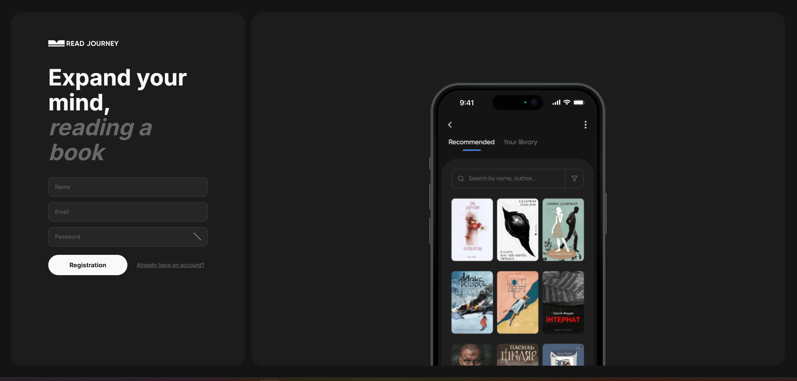
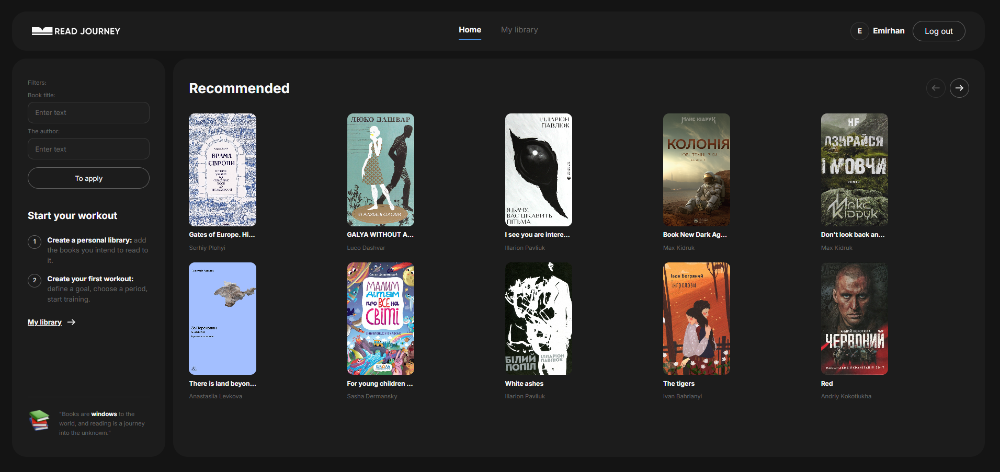
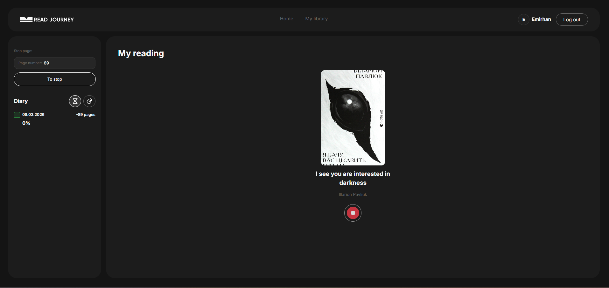

# 📚 Read Journey

A full-stack book tracking web application that helps you manage your reading library, track reading sessions, and monitor your progress — built with React, Redux Toolkit, and a REST API.

---

## 🌐 Live Demo

> [_Deploy link here (e.g. Vercel / Netlify)_](https://vercel.com/emirhan-bs-projects/read-journey)

---

## 📸 Screenshots

| Register / Login                               | Recommended                                   | My Library                                     | My Reading                                      |
| ---------------------------------------------- | --------------------------------------------- | ---------------------------------------------- | ----------------------------------------------- |
|  |  |  |  |

---

## ✨ Features

- 🔐 **Authentication** — Register, login, logout with JWT token persistence
- 📖 **My Library** — Add books manually or from Recommended; filter by status (unread / in-progress / done)
- 🏠 **Recommended** — Browse curated books with pagination and search by title/author
- ⏱️ **Reading Tracker** — Start/stop reading sessions with page tracking
- 📊 **Progress Stats** — Diary view with per-session stats, speed (pages/hour), and a circular progress chart
- 🔁 **Persistent Sessions** — F5 refresh keeps you on the same page (protected route with token refresh)
- 🔔 **Notifications** — Toast messages for all actions (success & error)
- 💅 **Responsive Design** — Works on mobile, tablet, and desktop

---

## 🛠️ Tech Stack

| Category      | Technology                                                         |
| ------------- | ------------------------------------------------------------------ |
| UI            | React 18, React Router v6                                          |
| State         | Redux Toolkit                                                      |
| Forms         | React Hook Form + Yup validation                                   |
| Styling       | CSS Modules                                                        |
| HTTP          | Axios                                                              |
| Notifications | react-hot-toast                                                    |
| Build Tool    | Vite                                                               |
| API           | [ReadJourney REST API](https://readjourney.b.goit.study/api-docs/) |

---

## 🚀 Getting Started

### Prerequisites

- Node.js `>= 18`
- npm `>= 9`

### Installation

```bash
# 1. Clone the repository
git clone https://github.com/Emirhan-bs/read-journey.git
cd read-journey

# 2. Install dependencies
npm install

# 3. Create environment file
cp .env.example .env
```

### Environment Variables

Create a `.env` file in the root of the project:

```env
VITE_API_URL=https://readjourney.b.goit.study/api
```

### Run Development Server

```bash
npm run dev
```

Open [http://localhost:5173](http://localhost:5173) in your browser.

### Build for Production

```bash
npm run build
npm run preview
```

---

## 📁 Project Structure

```
src/
├── assets/
│   └── images/
├── components/
│   ├── Header/
│   ├── Icon/
│   ├── Layout/
│   ├── Loader/
│   ├── Modal/
│   └── Notification/
├── hooks/
│   └── useAuth.js
├── pages/
│   ├── LoginPage/
│   ├── RegisterPage/
│   ├── RecommendedPage/
│   ├── LibraryPage/
│   └── ReadingPage/
├── redux/
│   ├── auth/
│   │   ├── authOperations.js
│   │   └── authSlice.js
│   ├── books/
│   │   ├── booksOperations.js
│   │   └── booksSlice.js
│   └── store.js
├── services/
│   └── api.js
├── App.jsx
├── main.jsx
└── index.css
```

---

## 🔑 API Reference

Base URL: `https://readjourney.b.goit.study/api`

| Method   | Endpoint                | Description                       |
| -------- | ----------------------- | --------------------------------- |
| `POST`   | `/users/register`       | Register a new user               |
| `POST`   | `/users/login`          | Login                             |
| `POST`   | `/users/logout`         | Logout                            |
| `GET`    | `/users/current`        | Get current user (token refresh)  |
| `GET`    | `/books/recommend`      | Get recommended books (paginated) |
| `GET`    | `/books/own`            | Get user's library                |
| `POST`   | `/books/add`            | Add book to library               |
| `DELETE` | `/books/remove/:id`     | Remove book from library          |
| `POST`   | `/books/reading/start`  | Start a reading session           |
| `POST`   | `/books/reading/finish` | Finish a reading session          |
| `DELETE` | `/books/reading/delete` | Delete a reading session          |

Full API docs: [https://readjourney.b.goit.study/api-docs/](https://readjourney.b.goit.study/api-docs/)

---

## 🧠 Key Implementation Details

### Auth Flow

Token is stored in `localStorage` and injected into every request via an Axios interceptor. On page refresh, `refreshUser` is called before any protected route renders — preventing incorrect redirects to login.

### Image Persistence

The ReadJourney API does not return `imageUrl` for user-added books. To solve this, book cover images from the Recommended catalog are cached in Redux state (`imageCache`) and patched onto library books by matching title and author.

### Reading Session Tracking

The app tracks active sessions (`startReading` without `finishReading`) and only allows deletion of completed sessions. The record button shows a ▶ play icon when idle and a ■ stop icon during an active session, with a pulsing white ring border.

---

## 👤 Author

**Emirhan Büyükşenirli**

- GitHub: [@Emirhan-bs](https://github.com/Emirhan-bs?tab=repositories)
- LinkedIn: [emirhan-buyuksenirli](https://www.linkedin.com/in/emirhan-buyuksenirli)

---

## 📄 License

This project is licensed under the MIT License.
